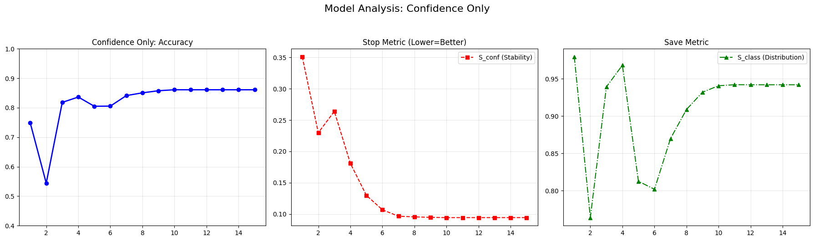
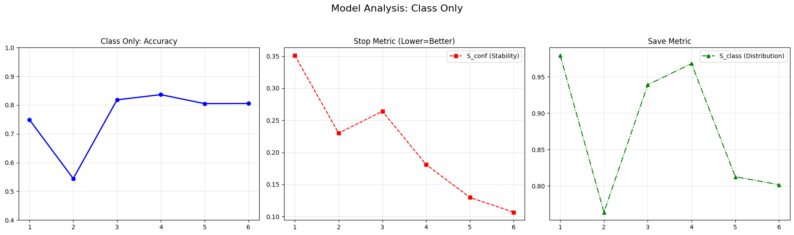
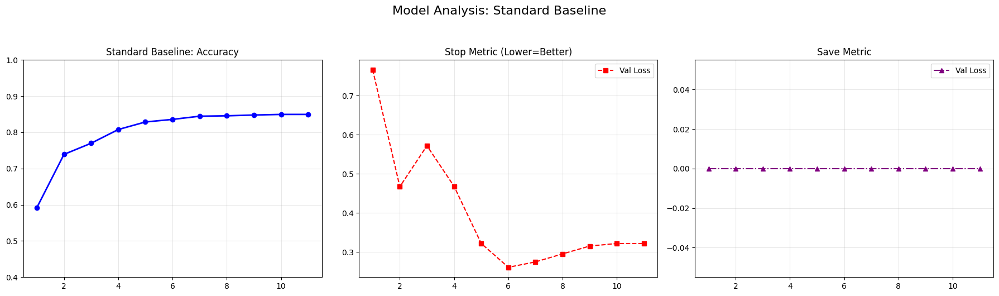
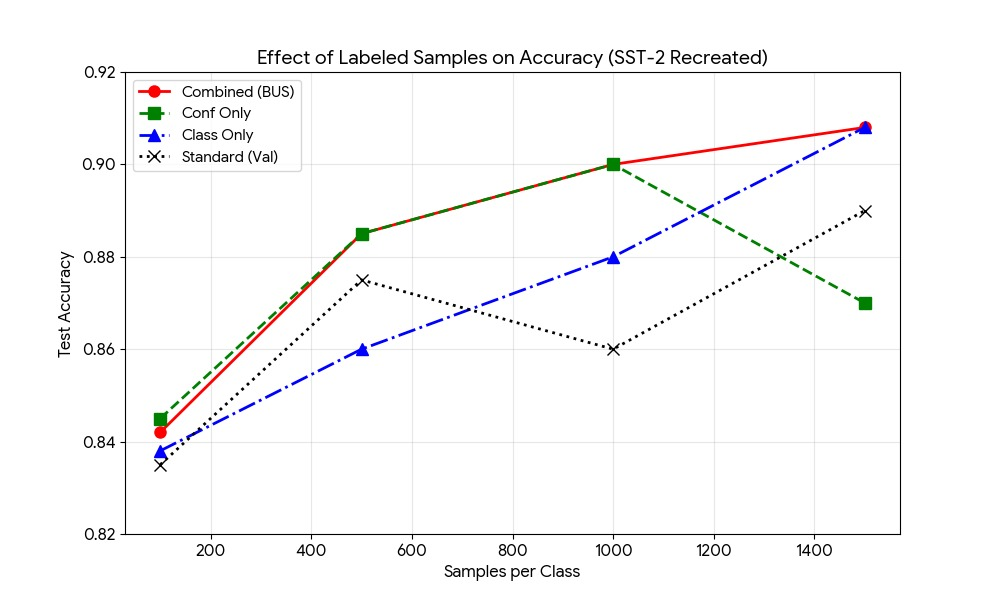

# 🚀 Ablation Analysis of the BUS-stop Dual-Criterion Mechanism

## 💡 Project Overview

This repository contains the code for the **ablation study of the BUS-stop** early stopping methodology. The original BUS-stop method employs a dual-criterion mechanism—**Confidence Similarity ($\text{S}_{\text{conf}}$)** for stability and **Class Distribution Similarity ($\text{S}_{\text{class}}$)** for checkpoint selection—on unlabeled data.

Our primary hypothesis is that this dual-criterion approach introduces unnecessary computational overhead, and a simplified **Confidence Similarity Only (CS-Only)** variant can achieve comparable performance (within 1% point) with 50% fewer metric calculations per epoch.


### 🔑 Key Findings Summary

The following table summarizes the performance metrics for the four tested early stopping strategies, directly supporting the hypothesis that the CS-Only approach is both efficient and accurate.

| Model Name | Stop Metric | Save Metric | Test Acc. | Total Epochs |
| :--- | :--- | :--- | :--- | :--- |
| **Combined (BUS)** | $\text{S}_{\text{conf}}$ | $\text{S}_{\text{class}}$ (queue avg) | **0.8611** | 15 |
| **CS-Only (Ablated)** | $\text{S}_{\text{conf}}$ | $\min \text{S}_{\text{conf}}$ | **0.8611** | 15 |
| **CDS-Only (Ablated)** | $-\text{S}_{\text{class}}$ | $\max \text{S}_{\text{class}}$ | 0.7490 | 6 |
| **Standard (Val)** | Val Loss | $\min$ Val Loss | 0.8358 | 11 |

**Analysis:** Experiments on the SST-2 dataset partially support this hypothesis: the
CS-Only variant matches the Combined (BUS) model’s peak
accuracy (0.8611), confirming the performance goal, while the
CDS-Only variant fails significantly (0.7490). This validates CS
as the primary convergence driver but reveals CDS is essential
for robust checkpoint selection. We conclude that CS alone
suffices for stopping decisions, though CDS should be retained
for checkpoint validation. This simplification reduces per-epoch
metric calculations by 50% without compromising generalization
performance, offering substantial efficiency gains for resource-
constrained fine-tuning scenarios.

***Individual Contributions***

* **Swapnali Kadam**
    * Email: skadam3@binghamton.edu| Github username: SwapnaliKadam-CS
    * Code Contributions
      - Built complete training infrastructure: data loading pipeline, BERT tokenization, validation splitting
      - Implemented Polynomial Decay learning rate scheduler for standardized convergence
      - Developed Combined (BUS) model with queue-averaging smoothing innovation (N=5) to prevent transient checkpoint spikes
      - Designed and executed large-scale data efficiency experiments (100-1500 samples), generated Figure 6
      
    * Paper Contributions
      - Methodology section with formal hypothesis and measurable goals, Experimental Design, Discussion and proposed optimal strategy.
    * Key Finding:
      Queue-averaging smoothing enhances checkpoint robustness by comparing S_class to rolling average instead of maximum
      
* **Yash Varpe**
    * Email: yvarpe@binghamton.edu| Github username: YashVarpe
    * Code Contributions
      - Orchestrated all 4 ablation experiments (Combined, CS-Only, CDS-Only, Standard) with consistent hyperparameters
      - Created Standard validation baseline for comparison
      - Created confusion matrix analysis (Figure 1) validating accuracy parity
      - Built training dynamics visualizations (Figures 2-5) showing convergence patterns
      - Performed robustness validation across multiple random seeds
      - Visualization
    * Paper Contributions
      - Abstract,Introduction, Background and Results with Visualization and data comparison.
    * Key Finding:
      Validated that CS-Only achieves identical accuracy (0.8611) to Combined model while reducing metric calculations by 50%
      
## 💻 Requirements and Installation

This project was developed and executed entirely within a **Google Colab** environment, which is the recommended method for reproduction.

Collab Link - https://colab.research.google.com/drive/10-Nmzf0JmuHuLveh-xI6cFKWLd9bzI4m?usp=sharing

### 1. Clone the Repository

Clone the original BUS-stop repository which serves as the base code, and navigate to the Keras implementation directory.

```bash
# 1. Clone the base BUS-stop repository
git clone [https://github.com/DMCB-GIST/BUS-stop.git](https://github.com/DMCB-GIST/BUS-stop.git)
%cd BUS-stop/bus-stop-keras
```
### 2. Install Dependencies 

```bash
The following dependencies are required:
!pip install -q tensorflow tf_keras
!pip install -q transformers==4.44.0 scikit-learn pandas sentencepiece datasets
```
### 3. Data and Model Setup 
```bash
This script downloads the $\text{BERT}_{\text{base-uncased}}$ model weights and generates the balanced SST-2 data splits (200 labeled samples) used for the main ablation study.
Bash# Ensure BERT files are downloaded and data splits are created
!rm -rf params/bert_base # Force fresh download
!python setup_experiments.py
```
### 4. Usage: Running the Ablation Study
The core experiments are run using the modified train_engine function (defined in the accompanying notebook/scripts) to execute the four model variants (Combined, Conf Only, Class Only, and Standard Baseline).

The commands below execute the primary ablation study:
```bash
# Assuming train_engine and Args are defined:
DEFAULT_SEED = 42

print("EXPERIMENT 1/4: Original BUS-stop (Combined)")
acc_orig, _, _, _ = train_engine("Combined", mode='combined', seed=DEFAULT_SEED)

print("\nEXPERIMENT 2/4: Confidence Similarity Only")
acc_conf, _, _, _ = train_engine("Conf Only", mode='conf', seed=DEFAULT_SEED)

print("\nEXPERIMENT 3/4: Class Distribution Only")
acc_class, _, _, _ = train_engine("Class Only", mode='class', seed=DEFAULT_SEED)

print("\nEXPERIMENT 4/4: Standard Validation (Baseline)")
acc_std, _, _, _ = train_engine("Standard", mode='standard', val_ratio=0.1, seed=DEFAULT_SEED)
```
### 5. Visualization and Validation 
The remaining code handle analysis and visualization:
Generates the Confusion Matrices for all four models.
Generates the epoch-by-epoch Training Dynamics plots (Accuracy, Stop Metric, Save Metric).
Executes the Robustness Check by running the core experiments with an alternate random seed to ensure stability.
Executes the Large-Scale Data Efficiency analysis to generate Figure 6.

### 🔗 Original Source Repository
This project is an ablation analysis built upon the original work:
Original Code: https://github.com/DMCB-GIST/BUS-stop
Ablation Analysis Code: https://github.com/SwapnaliKadam-CS/Ablation-Analysis-of-the-BUS-stop-Dual-Criterion-Mechanism

### 🖼 Results

### Confusion Matrix (Combined Model)


### Model Analysis: Combined (BUS)


### Model Analysis: Confidence Only


### Model Analysis: Class Only


### Model Analysis: Standard Baseline


### Effect of Labeled Samples on Accuracy (SST-2)

